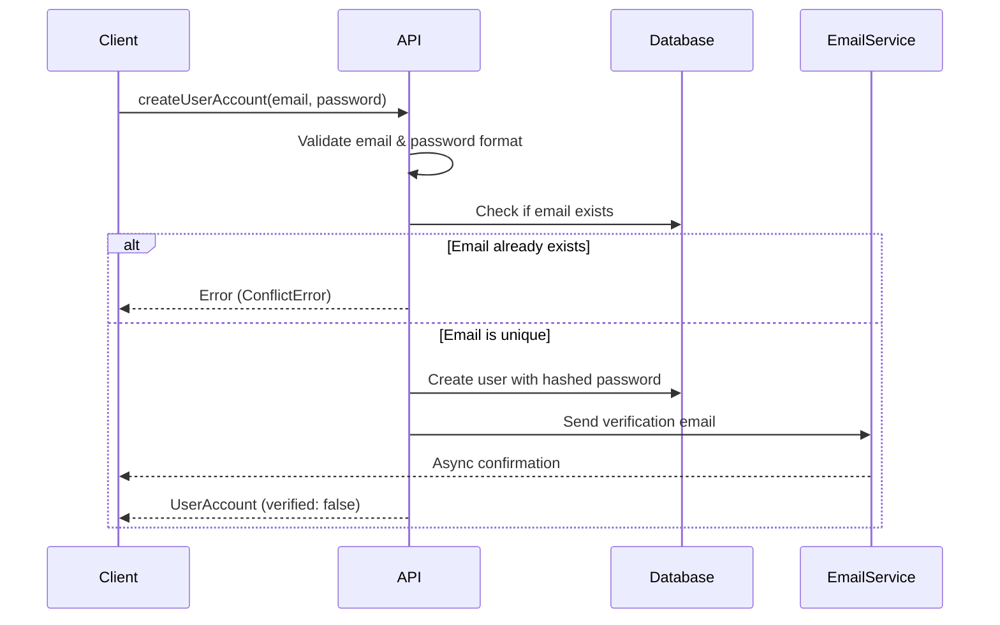

# 계약 템플릿 (Contract Template)

이 템플릿은 함수가 반드시 충족해야 할 요구사항을 구조화된 형식으로 정의합니다. 아래의 섹션 헤더들은 고정되어 있으며, 계약 파서가 이를 기반으로 작동합니다. 각 섹션의 내용은 자유롭게 작성할 수 있습니다.

---

## Signature

```ts
interface CreateUserAccountRequest {
  email: string;
  password: string;
}

interface UserAccount {
  id: string;
  email: string;
  createdAt: Date;
  verified: boolean;
}

function createUserAccount(
  req: CreateUserAccountRequest
): Promise<UserAccount>;
```

## Purpose

`createUserAccount`는 주어진 이메일과 비밀번호로 새로운 사용자 계정을 생성합니다.
생성된 계정은 초기에 미검증 상태이며, 검증 이메일이 사용자에게 발송됩니다.
이는 사용자 온보딩 플로우의 첫 단계입니다.

## Constraints

- 이메일은 RFC 5322 표준의 유효한 형식이어야 함
- 비밀번호는 최소 8자 이상이어야 함
- 비밀번호에는 영문(대/소문자), 숫자, 특수문자를 포함해야 함
- 이메일 중복은 허용되지 않음
- 입력값이 null 또는 undefined이면 거부

## Flow



## Invariants

- 반환되는 UserAccount는 항상 고유한 id를 가져야 함
- verified 필드는 항상 false로 초기화됨
- createdAt은 현재 시간과 일치해야 함
- 데이터베이스에 저장된 비밀번호는 항상 해시된 형태여야 함
- 검증 이메일은 정확히 한 번만 발송되어야 함

## Error Modes

```ts
type CreateUserAccountError =
  | ConflictError  // Email already registered
  | ValidationError  // Invalid email or password format
  | DatabaseError  // Database operation failed
  | EmailServiceError  // Failed to send verification email
  | InternalServerError;  // Unexpected error
```

---

## Notes

**메타 정보 (계약 포맷에 포함되지 않음)**

- 섹션 헤더는 대소문자를 무시하지만 정확한 이름(`Signature`, `Purpose`, `Constraints`, `Flow`, `Invariants`, `Error Modes`)이어야 함
- `Signature`과 `Error Modes` 섹션의 코드 블록은 반드시 ````ts`로 감싸야 함
- `Flow` 섹션만 선택사항(옵션)이며, 나머지는 필수
- 향후 Phase 2에서 `/Qcontract` 명령어가 이 템플릿을 기반으로 계약 초안을 생성할 예정
