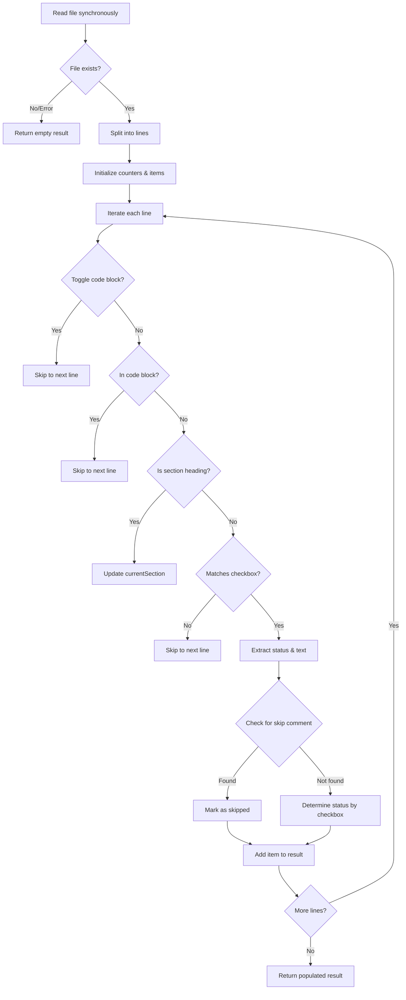

# checklist-parser Contract

Parses VERIFY_CHECKLIST markdown files to extract task items and their status.

---

## Signature

```ts
interface ChecklistItem {
  status: 'completed' | 'skipped' | 'remaining';
  text: string;
  line: number;
  section: string;
}

interface ChecklistResult {
  total: number;
  completed: number;
  remaining: number;
  skipped: number;
  items: ChecklistItem[];
}

function parseChecklist(filePath: string): ChecklistResult;

function isAllComplete(filePath: string): boolean;

function findNextRemaining(
  filePath: string
): null | {
  status: 'remaining';
  text: string;
  line: number;
  section: string;
};
```

## Purpose

`parseChecklist` reads a markdown checklist file and extracts all checkbox items (marked with `- [ ]`, `- [x]`, `- [~]`), categorizing them by completion status. `isAllComplete` returns true when all items are either completed or skipped. `findNextRemaining` locates the first incomplete item, returning null if the checklist is fully processed.

## Constraints

- Input must be a valid absolute file path (string)
- File is read as UTF-8 text; missing or unreadable files return an empty result (never throws)
- Only matches checkbox syntax: `- [CHAR]` where CHAR is space, x, X, or ~
- Checkbox status is case-insensitive for completion (`x` or `X` both mark completed)
- HTML comments (`<!-- skip -->`) within a line mark that item as skipped
- Items inside ``` code blocks are ignored (block state toggles on each ``` line)
- Section tracking captures lines matching `^##\s+` or `^###\s+`
- Text extraction strips trailing HTML comments from item description

## Flow



## Invariants

- `total === completed + remaining + skipped` (counts are mutually exclusive)
- Each item has exactly one status: completed, skipped, or remaining
- Line numbers are 1-indexed
- `currentSection` is preserved across items until next heading or end of file
- Empty file yields `{ total: 0, completed: 0, remaining: 0, skipped: 0, items: [] }`
- Missing file yields the same empty result (total-zero) without throwing
- `isAllComplete` returns true only if `remaining === 0 && total > 0`
- `findNextRemaining` returns null when no items have status 'remaining'

## Error Modes

```ts
// parseChecklist is total — never throws; all errors yield empty result
// { total: 0, completed: 0, remaining: 0, skipped: 0, items: [] }

// Silently handled conditions:
// - File does not exist
// - File read fails (permission denied, I/O error)
// - File encoding is not UTF-8 (readFileSync with utf-8 falls back gracefully)
// - Checkbox regex matches nothing (empty items array)
// - currentSection is undefined if no heading appears before first item
```

---
