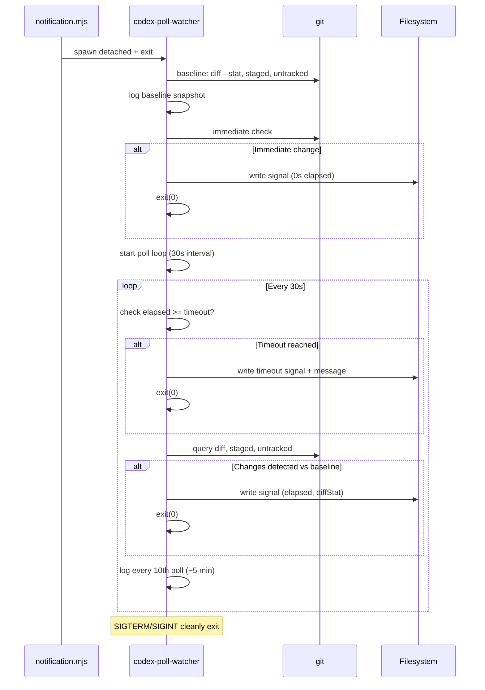

# Contract: codex-poll-watcher

Codex companion file materialization poller. Spawned by notification.mjs when Codex returns Done. Polls for filesystem changes (via `git diff --stat`, staged, untracked) every 30s with 1-hour hard cap. Atomically writes signal to `.qe/agent-results/codex-ready.signal` on change or timeout.

## Signature

```ts
// Standalone CLI module — no exports. Run as:
//   node codex-poll-watcher.mjs <cwd> [--interval 30] [--timeout 3600]

interface SignalPayload {
  detected: boolean;
  timestamp: string;      // ISO 8601
  diffStat?: string;      // git diff --stat output (if detected)
  elapsedSec: number;
  pollInterval: number;
  timeout?: boolean;      // true if timed out
  message?: string;       // user guidance on timeout
}
```

## Purpose

Background polling agent for async Codex companion pattern. Spawned detached after Codex rescuer returns Done. Monitors three git state vectors (unstaged diff, staged diff, untracked files) against baseline snapshot. On change, atomically writes signal with elapsed time and diff summary. On 1-hour timeout, writes timeout signal with user guidance (extend, retry, fallback, check process). Enables Claude to cheaply poll via Glob/Read.

## Constraints

- **Max poll duration**: 3600 seconds (1 hour), no exceptions
- **Poll interval**: 30 seconds (configurable via `--interval`, must be positive integer)
- **Signal paths**: writes to `.qe/agent-results/codex-ready.signal` + `.qe/agent-results/codex-poll.log`
- **Detection vectors**: `git diff --stat` (unstaged), `git diff --cached --stat` (staged), `git ls-files --others --exclude-standard` (untracked)
- **Immediate check**: runs at startup; if changes already present, exits with signal at 0s elapsed
- **No concurrent instances**: process isolation via PID logging not enforced by this module; caller must ensure single instance per cwd
- **Detached execution**: must survive parent termination (notification.mjs exits immediately)

## Flow



## Invariants

- **Signal atomicity**: writeFileSync ensures atomic write; no partial files
- **Polling never exceeds 1 hour**: `elapsed >= timeout` check at loop start, hard exit before next interval
- **Detection is differential**: changes detected by comparing three git vectors against baseline, not absolute filesystem scan
- **Baseline immutable**: taken once at startup, never updated
- **Timestamps ISO 8601**: `new Date().toISOString()` for all signal timestamps
- **Log appends safely**: writeFileSync with `{ flag: 'a' }` is safe for concurrent appends on same filesystem
- **No exceptions on git failure**: all `execSync` wrapped in try-catch; silent fallback to empty string
- **Process signals handled**: SIGTERM and SIGINT cleanly clear interval + exit
- **Combined diff output**: if multiple vectors have changes, joined with `\n` separator
- **Poll count increments**: every interval regardless of change detection, used for 10-poll log batching
- **Exit codes**: always 0 (success), whether timed out or detected

## Error Modes

```ts
type WatcherExitMode =
  | { detected: true; elapsedSec: number }     // Changes found, signal written
  | { timeout: true; elapsedSec: number }      // 1h limit hit, timeout signal written
  | { gitError: true }                         // git infrastructure failed (all 3 commands fail)
  | { fsError: true }                          // signal dir creation or write failed
  | { parentExit: unknown }                    // parent process died (process signal)
  ;

// Module never throws. All errors logged to codex-poll.log.
// On git command timeout (10s individual), silently skips that vector.
// On signal write failure, logs to file but continues polling.
never: Error;
```

## Notes

- **No test file yet**: codex-poll-watcher.test.mjs does not exist. This module is long-running async (spawned detached); conventional unit test difficult. Recommend: integration test harness that spins up watcher, creates git changes, verifies signal. Marked as async coverage gap.
- **Direct CLI invocation only**: no export statement; always run via child_process spawn from notification.mjs.
- **Timeout signal message**: user guidance string suggests 4 recovery paths (extend, retry, fallback, debug).
- **Log file grows unbounded**: consider log rotation if watcher runs frequently. Currently relies on operator cleanup.
