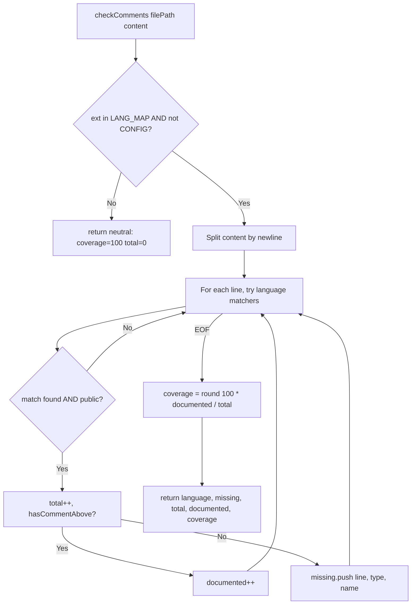

# Contract: comment-checker

소스 코드 파일의 문서화 주석 누락을 탐지하는 순수 정규식 기반 분석기. 13개 언어에 대해 각 언어의 standard doc comment 패턴(JSDoc, Javadoc, KDoc, rustdoc 등)이 public signature 바로 위에 존재하는지 검사.

## Signature

```ts
type Language = 'javascript' | 'typescript' | 'python' | 'java' | 'kotlin'
              | 'go' | 'rust' | 'cpp' | 'csharp' | 'swift' | 'php' | 'ruby' | 'dart' | 'unknown';

type MissingItem = {
  line: number;      // 1-indexed line number where signature appears
  type: string;      // 'function' | 'class' | 'method' | 'item'
  name: string;      // identifier (public only)
};

type CheckResult = {
  language: Language;
  missing: MissingItem[];
  total: number;      // number of public signatures found
  documented: number; // number of them with doc comment immediately above
  coverage: number;   // percent, 0-100, rounded
};

export function isCheckableFile(filePath: string): boolean;

export function checkComments(filePath: string, content: string): CheckResult;
```

## Purpose

`/Qcode-run-task`의 Step 4.8 Comment Coverage Gate에서 변경된 코드의 문서화 커버리지를 80%/50% 임계치로 평가하기 위한 엔진. 파일 단위로 public signature 개수를 세고, 각 signature 직상단 5줄 내에 language-appropriate doc comment가 있는지 확인.

## Constraints

- 지원 확장자: `.js/.jsx/.mjs/.ts/.tsx/.py/.java/.kt/.go/.rs/.cpp/.h/.hpp/.c/.cs/.swift/.php/.rb/.dart` 외엔 모두 `{language: 'unknown', total: 0, coverage: 100}` 반환 (no-op)
- Config 파일(`.json/.yaml/.yml/.toml/.xml/.env`)은 항상 `isCheckableFile = false`
- **Private 심볼 제외**: identifier가 `_` 또는 `#`로 시작하거나, 라인에 `\bprivate\b` 키워드 있으면 total 카운트에서 제외
- Java/Kotlin/C#: `public|protected|internal` 키워드가 명시된 signature만 검사
- Go: export 규칙상 **대문자 시작 identifier만** 검사
- Rust/Swift: `pub`/`public` 키워드 있는 item만
- Doc comment look-back 범위: signature 라인 바로 위 최대 5줄. 이 범위 내 blank line + 블록 주석 continuation(`* `, ` */`)은 transparent (JSDoc 여러 줄 블록을 한 단위로 인식)
- **No I/O**: `content`는 caller가 이미 읽은 text; 함수 내부에서 filesystem access 없음

## Flow



## Invariants

- **Total function**: 어떤 입력(빈 string, 바이너리-스러운 text, 매우 긴 파일)에도 throw 하지 않음
- **Coverage 경계값**: `total === 0`일 때 `coverage === 100` (division-by-zero 방지)
- **커버리지 수식**: `coverage === Math.round(100 * documented / total)` 0~100 정수
- **Private 제외 일관성**: `_` / `#` / `private` 키워드 중 하나라도 매칭되는 signature는 total에도, missing에도, documented에도 포함되지 않음
- **Line numbers 1-indexed**: `missing[i].line`은 1 이상의 정수, 파일의 실제 라인 번호와 정확히 일치
- **지원 언어 13개 고정**: `LANG_MAP` 변경 없이는 새 언어 추가 불가 — 확장 시 반드시 `COMMENT_ABOVE`와 `getMatchers()`에도 엔트리 추가
- **블록 주석 인식**: JSDoc/KDoc/Javadoc 블록(`/** ... */`)이 signature 바로 위에 있으면 `documented` 카운트에 포함. 중간의 `* ` 라인은 transparent
- **Language-specific doc convention 준수**: go는 `//`, rust는 `/// \|\| //!`, swift는 `///`, python은 `""" \|\| ''' \|\| #` 등 해당 언어의 관례적 doc 마커만 인정

## Error Modes

```ts
// checkComments is total — never throws.
// Unsupported file → { language: 'unknown', missing: [], total: 0, documented: 0, coverage: 100 }
// Invalid content type (not a string) would throw TypeError on .split call — but caller is expected to pass string.
never: Error;
```

## Notes

- `getMatchers` 내부 함수는 export되지 않음 — 언어별 signature regex 레지스트리로만 기능
- 함수가 검출하는 signature 수와 실제 "문서화가 필요한 public API"의 개수가 완전히 일치하진 않음 (정규식 기반이므로). 경험적으로 80%+ 정확도 목표.
- Phase 4 Contract Layer의 **Coverage Gate** 기반으로 Qcode-run-task가 80% 미만이면 warning, 50% 미만이면 FAIL 판정
