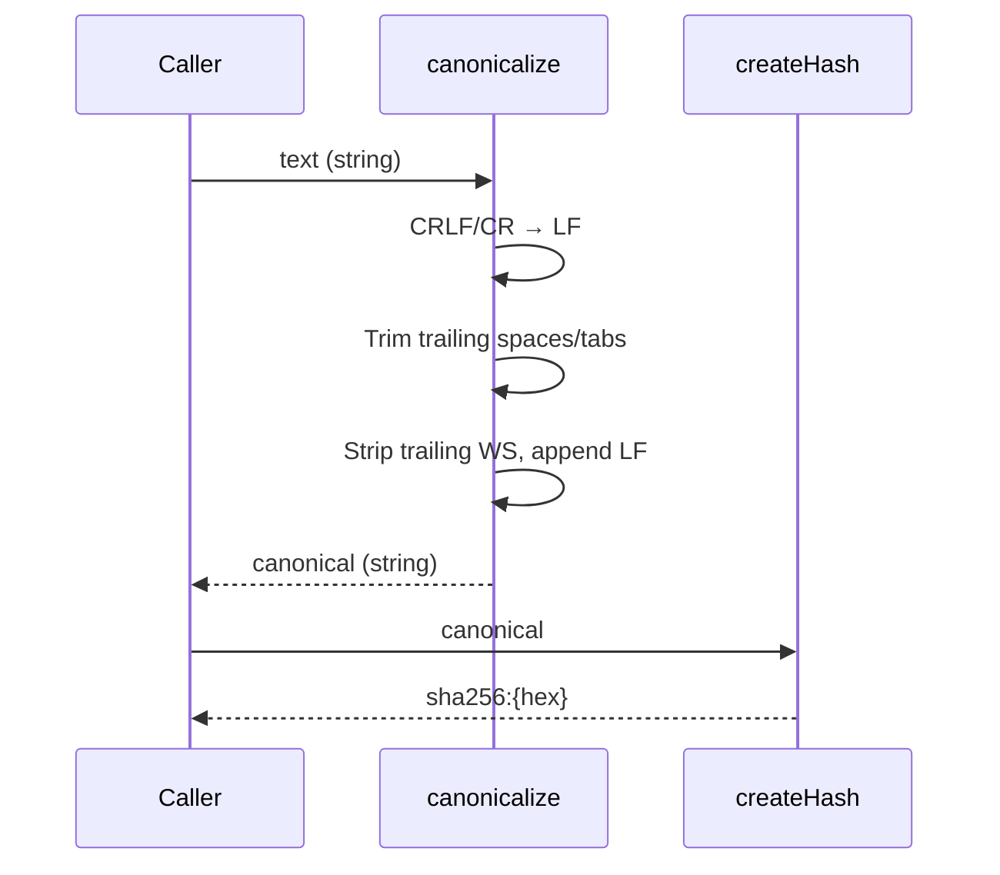

# Contract Hash Library

Compute stable SHA-256 hashes of canonicalized contract text for deterministic identity and change detection.

---

## Signature

```ts
export function canonicalize(text: string): string;

export function computeContractHash(text: string): string;
```

## Purpose

Compute a stable SHA-256 hash of canonicalized contract text. Canonicalization normalizes line endings, trims trailing whitespace, and enforces a single trailing newline so trivially-different inputs produce identical hashes.

## Constraints

- Input must be a string (TypeError raised otherwise)
- Returned hash is prefixed with `sha256:` followed by 64 hexadecimal characters
- Canonicalize is a pure string operation with no side effects
- CRLF and CR line endings are normalized to LF
- Trailing spaces and tabs on each line are removed
- All trailing whitespace and newlines are stripped, then a single LF is appended

## Flow



## Invariants

- Same canonicalized content always produces identical hash (determinism)
- CRLF-normalized and LF-original of same content yield identical hashes
- Trailing whitespace on lines does not affect hash
- Any number of trailing newlines resolves to exactly one
- Non-string input causes TypeError (never returns a hash)
- Hash format is always `sha256:` + exactly 64 lowercase hex characters

## Error Modes

```ts
// computeContractHash(text)
// - if text is not a string: TypeError

TypeError;  // "computeContractHash requires a string"
```

---

## Notes

- `canonicalize()` is exported for testing and integration purposes
- `computeContractHash()` is the primary export for contract identity
- Both functions are synchronous pure functions (no I/O, no side effects)
- The default export is `computeContractHash`
