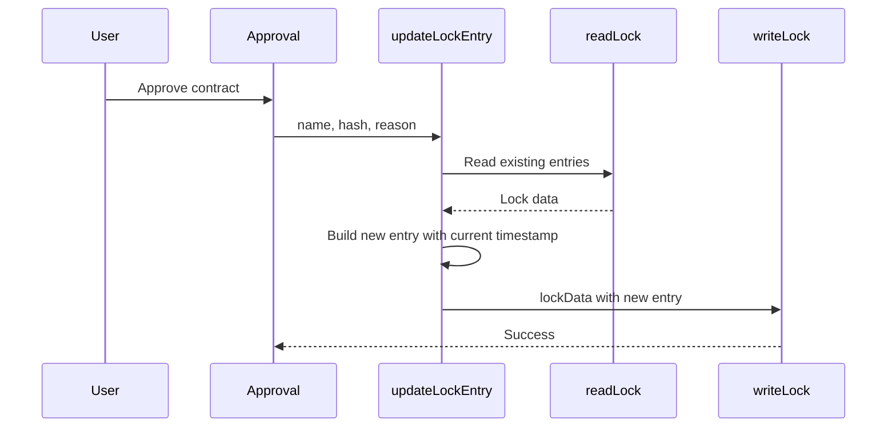

# Contract Lock Manager

Lock file manager for the contract layer's approval mechanism. Maintains `.qe/contracts/.lock` as the machine-enforced half of the 3-layer approval defense.

---

## Signature

```ts
interface LockEntry {
  hash: string;
  approved_at: string;
  reason: string;
}

interface VerifyResult =
  | { status: 'match' }
  | { status: 'mismatch'; expected: string; actual: string }
  | { status: 'unapproved' };

function readLock(baseDir?: string): Record<string, LockEntry>;

function writeLock(lockData: object, baseDir?: string): void;

function updateLockEntry(
  name: string,
  hash: string,
  reason: string,
  baseDir?: string
): LockEntry;

function removeLockEntry(name: string, baseDir?: string): boolean;

function verifyLock(
  name: string,
  content: string,
  baseDir?: string
): VerifyResult;
```

## Purpose

`contract-lock` manages the `.qe/contracts/.lock` JSON file that tracks approved contract hashes with timestamp and reason.
This module provides the machine-enforced half of the 3-layer approval defense, enabling verification that contract edits have been explicitly approved before enforcement.

## Constraints

- All name-accepting functions validate via `assertValidContractName` (defense-in-depth)
- `reason` field is truncated to 500 characters
- Lock file path is always `.qe/contracts/.lock` relative to baseDir (or process.cwd())
- `readLock` returns empty object `{}` when file is missing (not null), throws only on malformed JSON
- `baseDir` parameter defaults to `process.cwd()` when omitted

## Flow



## Invariants

- `writeLock` replaces the entire lock file atomically (no torn writes)
- `removeLockEntry` preserves all other entries in the lock
- `verifyLock` uses `computeContractHash` for canonicalized comparison (CRLF-invariant)
- A reserved or path-traversal name is rejected BEFORE any file access
- `updateLockEntry` always sets `approved_at` to current ISO 8601 timestamp

## Error Modes

```ts
Error("Invalid contract name: ...");  // name rejected at entry via assertValidContractName

Error("Malformed .qe/contracts/.lock — manual cleanup required");  // corrupt JSON on readLock
```

---

## Notes

- `verifyLock` returns `{ status: 'unapproved' }` when no entry exists for the name
- Lock file is formatted as pretty-printed JSON (2-space indent) with trailing newline
- `removeLockEntry` returns boolean (true if deleted, false if not found)
