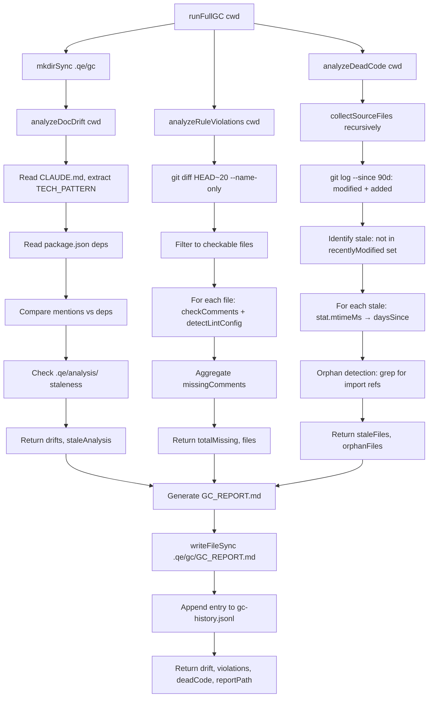

# Contract: gc-analyzer

Garbage Collection analyzer for the `/Qgc` skill. Scans project for code quality debt: documentation-code drift (frameworks mentioned in CLAUDE.md but missing from package.json, stale analysis files), rule violations (missing comment coverage, lint availability), and dead code (stale and orphan files). Produces structured reports in Markdown and JSONL formats.

## Signature

```ts
type DriftIssue = {
  file: string;
  issue: string;
  severity: 'warn' | 'info';
};

type DocDriftResult = {
  drifts: DriftIssue[];
  staleAnalysis: boolean;
};

type RuleViolationFile = {
  path: string;
  missingComments: number;
  lintAvailable: boolean;
};

type RuleViolationResult = {
  totalMissing: number;
  files: RuleViolationFile[];
};

type DeadCodeFile = {
  path: string;
  lastModified: string;
  daysSinceModify: number;
};

type DeadCodeOrphan = {
  path: string;
  reason: string;
};

type DeadCodeResult = {
  staleFiles: DeadCodeFile[];
  orphanFiles: DeadCodeOrphan[];
};

type FullGCResult = {
  drift: DocDriftResult;
  violations: RuleViolationResult;
  deadCode: DeadCodeResult;
  reportPath: string;
};

export function analyzeDocDrift(cwd: string): DocDriftResult;

export function analyzeRuleViolations(cwd: string): RuleViolationResult;

export function analyzeDeadCode(cwd: string): DeadCodeResult;

export function runFullGC(cwd: string): FullGCResult;
```

## Purpose

Three-phase analyzer used by `/Qgc` skill to detect code quality debt across documentation drift, rule violations, and dead code. `analyzeDocDrift` compares frameworks/tools mentioned in CLAUDE.md against package.json dependencies and flags stale analysis files (>7 days old). `analyzeRuleViolations` scans recently changed files (last 20 commits) for missing comment documentation and checks lint availability. `analyzeDeadCode` identifies stale files (>90 days without modification) and orphan candidates (no import references in source). `runFullGC` orchestrates all three, writes GC_REPORT.md and appends timestamped entry to gc-history.jsonl.

## Constraints

- **Input**: `cwd` is absolute path to project root; filesystem must be readable
- **Scanned directories**: `.qe/`, `node_modules/`, `.git/`, `dist/`, `build/` excluded via `SKIP_DIRS`
- **Source file extensions**: `.js`, `.mjs`, `.jsx`, `.ts`, `.tsx`, `.py`, `.go`, `.rs`, `.java`, `.kt`, `.rb`, `.php`, `.dart`, `.cs`, `.swift`, `.cpp`, `.c`, `.h`, `.hpp`
- **MAX_FILES limit**: At most 50 files analyzed per function (hard cap on stale files, orphan candidates, checkable violations)
- **Framework detection**: `TECH_PATTERN` matches 32 common frameworks/tools; case-insensitive; skips generic language names (javascript, typescript, python, golang, rust, java, kotlin, claude, codex)
- **Dep normalization**: package.json deps are lowercase and scoped-prefix-stripped; substring matching allows fuzzy drift detection
- **Git operations**: All git commands silently fail-over (return empty string) if git unavailable, timeout 3–5s
- **I/O safety**: All reads wrapped in try-catch; binary content detected via null-byte check; unreadable files skipped, process continues
- **Output shape**: All results JSON-serializable; file paths are relative to `cwd`; dates in ISO 8601 format or YYYY-MM-DD; numbers are integers

## Flow



## Invariants

- **Never modifies source files**: All functions are read-only; no writes except GC_REPORT.md and gc-history.jsonl
- **Skipped patterns are deterministic**: `SKIP_DIRS` constant fixed; directory skip rules do not vary by state
- **Output is JSON-serializable**: All arrays, objects, strings, numbers, booleans; no circular references; dates as ISO strings
- **No throw**: All four exports never throw; partial failures (unreadable files, failed git calls) degrade gracefully to empty/zero results
- **Coverage formula consistency**: `(documented / total) * 100` rounded; when `total === 0`, returns `coverage: 100` (via comment-checker)
- **Line numbers 1-indexed**: All line numbers in violation reports match actual source file lines
- **Git date parsing**: ISO and arbitrary string dates coerced via `new Date()`; invalid dates treated as `null`, skipped
- **Stale file age**: 7 days = 7 × 24 × 60 × 60 × 1000 ms; 90 days = 90 × 24 × 60 × 60 × 1000 ms
- **Orphan detection shell safety**: File names sanitized via `/[^a-zA-Z0-9_\-\.]/g` replacement; only alphanumeric, hyphen, underscore, dot allowed
- **Report timestamps**: All entries in gc-history.jsonl are ISO 8601 strings; one entry per invocation
- **Relative paths**: All file paths in output are relative to `cwd`, not absolute

## Error Modes

```ts
type GCAnalyzerError = never;

// All functions gracefully degrade on I/O failure:

// analyzeDocDrift:
//   - CLAUDE.md missing → drifts from package.json check only
//   - package.json malformed → skip dep check, return only CLAUDE.md drift
//   - .qe/analysis/ missing → skip staleness check, return only dep drift
//   - Any read error → catch, return partial result

// analyzeRuleViolations:
//   - git diff fails → return { totalMissing: 0, files: [] }
//   - changed file unreadable → skip, continue loop
//   - comment-checker called with checkable file paths only

// analyzeDeadCode:
//   - git log fails → recentlyModified is empty, all files are stale
//   - collectSourceFiles depth limit: stops at MAX_FILES
//   - orphan grep sanitizes names, skips index files and length ≤ 2
//   - import detection is heuristic (grep-based), no guarantee of completeness

// runFullGC:
//   - mkdirSync .qe/gc fails → continue (may write report to read-only dir, which also fails)
//   - writeFileSync GC_REPORT.md fails → non-fatal, continue to history
//   - writeFileSync gc-history.jsonl fails → non-fatal, function completes
```

## Notes

**Test coverage gap**: `hooks/scripts/lib/__tests__/gc-analyzer.test.mjs` does not exist. Contract Layer LLM judge will flag "no tests provided" as MAJOR finding. Recommend adding comprehensive test suite covering: edge cases (empty project, no git history), graceful degradation (unreadable files, missing CLAUDE.md), orphan detection accuracy, and report format validation.
