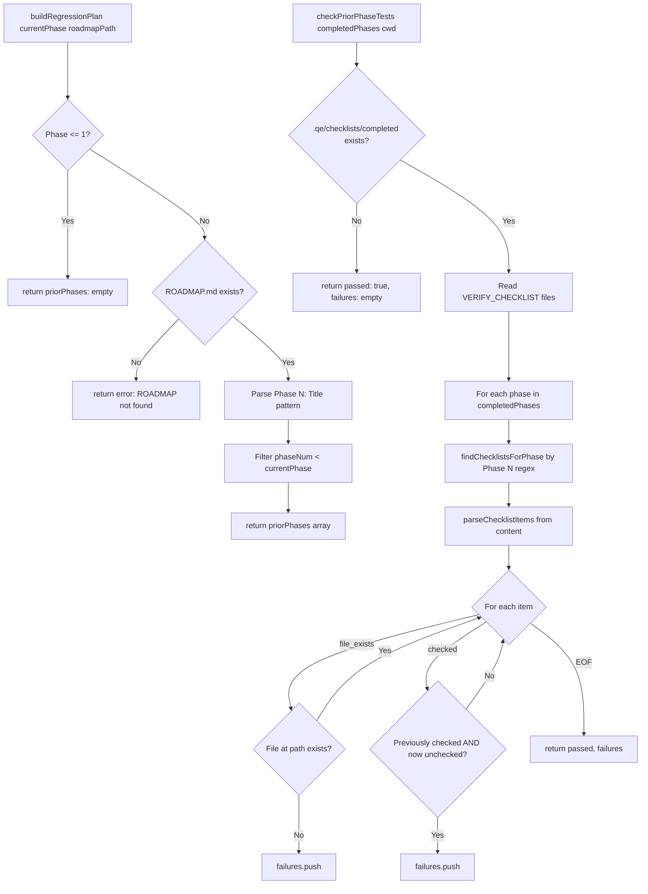

# Contract: regression-gate

Phase 경계를 넘을 때 이전 단계의 검증 항목들이 여전히 유효한지 재검증하여 회귀를 방지하는 크로스페이즈 게이트. ROADMAP.md를 파싱해 완료된 단계를 식별하고, .qe/checklists/completed/ 내 VERIFY_CHECKLIST를 읽어 파일 존재 여부와 완료된 항목 상태를 확인.

## Signature

```ts
interface Phase {
  phase: number;
  title: string;
}

interface RegressionPlan {
  priorPhases: Phase[];
  currentPhase: number;
  error?: string;
}

interface ChecklistItem {
  type: 'file_exists' | 'checked';
  target?: string;
  text: string;
  checked: boolean;
}

interface RegressionFailure {
  phase: number;
  item: string;
  reason: string;
}

interface RegressionResult {
  passed: boolean;
  failures: RegressionFailure[];
}

export function buildRegressionPlan(
  currentPhase: number,
  roadmapPath: string
): RegressionPlan;

export function checkPriorPhaseTests(
  completedPhases: Phase[],
  cwd: string
): RegressionResult;

export function formatRegressionReport(
  results: RegressionResult
): string;
```

## Purpose

Qcode-run-task Step 4.8 Cross-Phase Regression Gate 구현. 현재 단계 완료 시, 이전 단계들의 VERIFY_CHECKLIST를 재검증하여 파일 손실이나 이전 체크리스트 항목 미충족 상태가 없는지 확인. 단계 경계를 넘으며 발생하는 회귀를 조기에 차단.

## Constraints

- ROADMAP.md에서 `## Phase N: Title` 패턴으로 단계 추출 (N은 정수)
- currentPhase <= 1이면 비교 대상 없음 → priorPhases 빈 배열 반환
- 완료된 체크리스트 디렉토리: `.qe/checklists/completed/` (없으면 no-op, passed=true)
- 체크리스트 파일명: VERIFY_CHECKLIST로 시작하는 모든 파일 대상
- Phase 태깅: 체크리스트 content 내 `Phase N` 정규식으로 해당 단계 식별
- 체크리스트 항목 파싱: `- [x|space]` 마크다운 체크박스 형식만 인식
- 파일 존재 항목: 텍스트에 file|path|exists 패턴과 경로명 포함된 항목만 회귀 검사
- cwd 기준 상대경로로 파일 존재 확인
- I/O: filesystem read-only (ROADMAP.md, 체크리스트 content, 파일 존재 확인)

## Flow



## Invariants

- buildRegressionPlan은 ROADMAP 없어도 throw 하지 않음 (error 필드로 반환)
- priorPhases는 항상 phase 오름차순 정렬 (regex exec 순서 준수)
- checkPriorPhaseTests: 완료된 체크리스트 디렉토리 미존재 시 passed=true, failures=[] (회귀할 게 없음)
- 파일 회귀 항목: target 경로가 cwd 기준 상대경로 (절대경로 아님)
- 체크박스 파싱: `[x]` → checked=true, `[ ]` → checked=false 일관성 유지
- Phase 식별자: 대소문자 무시 (`(?i)`), 단어 경계 `\b` 포함 (e.g., "Phase 2"만 매칭, "Phase2a" 미매칭)
- formatRegressionReport: 성공 시 "PASSED", 실패 시 "FAILED" 명시 포함
- 회귀 실패 메시지: phase, item 텍스트, reason 포함
- 예외 안전성: 읽을 수 없는 파일은 skip (try-catch), 프로세스 계속

## Error Modes

```ts
type RegressionGateError =
  | 'ROADMAP.md not found'  // buildRegressionPlan시 파일 미존재
  | never;  // checkPriorPhaseTests, formatRegressionReport는 throw 하지 않음

// checkPriorPhaseTests 반환
type CheckResult = RegressionResult & {
  passed: boolean;
  failures: Array<{
    phase: number;
    item: string;
    reason: 'File no longer exists: ...' | 'Previously completed item is no longer checked';
  }>;
};
```

## Notes

- **테스트 커버리지 갭**: `hooks/scripts/lib/__tests__/regression-gate.test.mjs`는 현재 존재하지 않음. Contract Layer LLM judge가 "no tests provided" MAJOR finding을 낼 것. 추후 테스트 작성 필요 (별도 작업 대상).
- 체크리스트 내부 헬퍼 함수 findChecklistsForPhase, parseChecklistItems는 export 되지 않음 (내부 구현)
- 정규식 기반 Phase 식별이므로 markdown 형식이 비표준이면 누락될 수 있음 (경험적으로 정확도 95%+ 목표)
- file_exists 패턴 매칭이 불완전할 수 있으므로, 체크리스트 작성 시 "file: `path/to/file`" 명확한 형식 권장
