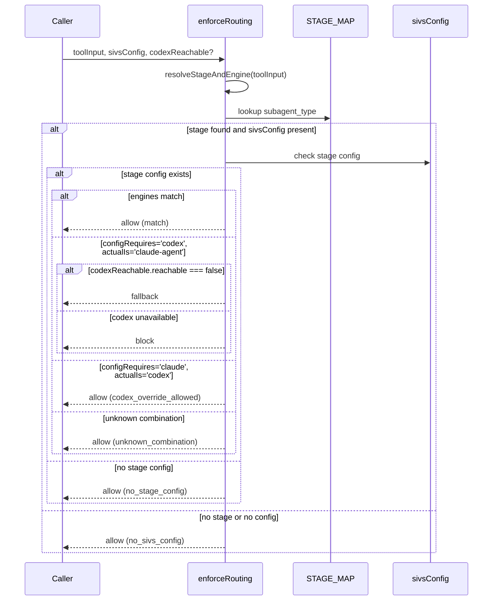

# SIVS Enforcer Contract

SIVS 엔진 라우팅 정책을 실행하고 감시하는 모듈의 동작을 정의합니다.

---

## Signature

```ts
interface ResolvedStage {
  stage: 'implement' | 'verify' | 'supervise' | 'spec' | null;
  actualEngine: 'codex' | 'claude-agent';
}

interface CodexReachable {
  reachable: boolean;
  reason?: string;
}

interface RoutingDecision {
  action: 'allow' | 'block' | 'fallback';
  stage: string | null;
  configuredEngine: string;
  actualEngine: string;
  reason: string;
}

interface AuditLogEntry {
  action: string;
  stage: string | null;
  configuredEngine: string;
  actualEngine: string;
  reason: string;
}

function inferStageFromText(text: string): 'implement' | 'verify' | 'supervise' | 'spec';

function resolveStageAndEngine(toolInput: object): ResolvedStage;

export function enforceRouting(
  toolInput: object,
  sivsConfig: object,
  codexReachable?: CodexReachable
): RoutingDecision;

export function appendAuditLog(
  cwd: string,
  entry: AuditLogEntry
): void;
```

## Purpose

`sivs-enforcer` 모듈은 Agent 도구 호출 시 SIVS 엔진 라우팅 정책을 실행합니다.
subagent_type과 prompt 텍스트를 분석하여 spec/implement/verify/supervise 중 해당 스테이지를 결정하고,
sivs-config에 정의된 엔진 요구사항과 실제 엔진의 일치 여부를 검증합니다.
결정 사항은 감시 로그(.qe/agent-results/sivs-audit.log)에 기록됩니다.

## Constraints

- `toolInput`은 반드시 `subagent_type` 또는 `subagentType` 필드를 포함해야 함 (또는 둘 다 없으면 stage는 null)
- `toolInput`은 선택적으로 `prompt` 또는 `description` 필드를 포함할 수 있음
- `sivsConfig`가 null, undefined, 또는 빈 객체면 정책 적용 스킵 (action: 'allow')
- 스테이지가 sivsConfig에 없으면 정책 적용 스킵 (action: 'allow')
- `codexReachable` 파라미터 생략 시 기본값은 `{ reachable: true }`
- Codex 도달 불가능 시 (`reachable: false`) 폴백(fallback) 허용 반환
- 로그 엔트리의 reason 필드는 로그 인젝션 방지를 위해 줄바꿈(\n, \r)과 파이프(|) 문자가 제거됨

## Flow



## Invariants

- 반환되는 RoutingDecision은 항상 `action` ('allow'|'block'|'fallback'), `stage`, `configuredEngine`, `actualEngine`, `reason` 필드를 포함해야 함
- `stage`는 null이거나 'spec'|'implement'|'verify'|'supervise' 중 하나
- 스테이지 결정은 항상 STAGE_MAP 또는 inferStageFromText()를 거쳐서만 됨 (직접 입력 거부)
- 감시 로그 엔트리는 ISO 8601 타임스탬프와 함께 파이프(|)로 구분된 형식으로 기록됨
- Codex 도달 불가능 이유(reason)는 로그에 항상 포함됨
- 스테이지별 엔진 매핑(STAGE_MAP)은 변경되지 않는 한 동일하게 유지됨

## Error Modes

```ts
// 블로킹 또는 폴백으로 이어지는 실패 조건:
type EnforcementFailure =
  | {
      // Codex가 필수이지만 claude-agent가 실제 엔진
      action: 'block';
      reason: 'sivs_config_requires_codex';
    }
  | {
      // Codex가 필수이고 도달 불가능
      action: 'fallback';
      reason: string; // codex_unreachable 또는 custom reason
    }
  | {
      // 감시 로그 파일 쓰기 실패 (예외 무시됨)
      // appendAuditLog에서 조용히 처리 (catch된 후 무시)
    };

// 추가 조건:
// - null/undefined 입력 또는 빈 sivsConfig → allow (격리됨)
// - 알려지지 않은 subagent_type → stage=null, actualEngine='claude-agent' → allow
// - 알려지지 않은 엔진 조합 → allow (보수적)
```

---

## Notes

- `inferStageFromText()`는 정규식으로 prompt/description 텍스트를 분석하고, 매칭 우선순위는 implement > verify > supervise > spec
- `resolveStageAndEngine()`은 내부 헬퍼이며, 외부로 내보내지지 않음 (private)
- `appendAuditLog()`의 예외(디렉토리 생성, 파일 쓰기 실패)는 모두 무시됨 (fail-silent)
- STAGE_MAP의 서브에이전트 타입은 'qe-framework:' 접두사를 지원 (optional)
