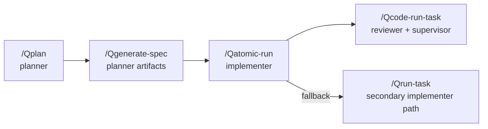

# Multi-Model Setup Guide

> Architectural source of truth: `core/MULTI_MODEL_ORCHESTRATION.md`. This guide shows how to activate the minimum first-pass orchestration layer without changing the runtime engine.

## Overview
- Multi-model orchestration separates planning, implementation, review, and supervision so no single model plans and grades its own work.
- Tiered-model orchestration uses one provider with multiple model strengths, so difficult planning and judgment stay on the high tier while routine work stays on cheaper tiers.
- The new workflow relies on config + artifacts under `.qe/ai-team/` to pass context between roles and named runner instances.
- Backward compatibility is preserved: nothing changes until `team-config.json` exists with `mode` set to `multi-model`, `hybrid`, or `tiered-model`.

## Modes
| Mode | When Active | Behavior |
|------|-------------|----------|
| `single-model` | Default, no config or explicit single mode | Legacy Claude-centric path. Planner, implementer, reviewer, supervisor can all be the same provider. No extra artifacts required. |
| `multi-model` | `.qe/ai-team/config/team-config.json` with `mode: "multi-model"` | Strict role handoffs. Planner writes `role-spec.md` + `task-bundle.json`, implementer writes `implementation-report.md`, reviewer writes `review-report.md`, supervisor writes `verification-report.md`. |
| `hybrid` | Config present with `mode: "hybrid"` | Planner + supervisor may stay on Claude while implementation/review run elsewhere. Same artifacts and gates as multi-model. |
| `tiered-model` | Config present with `mode: "tiered-model"` | One provider uses model tiers by difficulty. Typical setups: Claude uses Opus/Sonnet/Haiku and Codex uses GPT-5.4/GPT-5-Codex/GPT-5-Codex-Mini. |

## Configuration
1. Run `/Qinit` and opt into **Multi-Model Orchestration**. It creates:
   ```
   .qe/ai-team/
     config/team-config.json
     artifacts/{role-spec.md,task-bundle.json,implementation-report.md,review-report.md,verification-report.md}
     runs/
   ```
2. Validate configs with `node scripts/validate_ai_team_config.mjs .qe/ai-team/config/team-config.json`. Pass `--schema core/schemas/team-config.schema.json` (or another path) when testing schema changes.
3. Edit the template to match your runner assignments. Fields enforced by `core/schemas/team-config.schema.json`:
   - `version`: must be `1`.
   - `mode`: `single-model`, `multi-model`, `hybrid`, or `tiered-model`.
   - `roles`: planner, implementer, reviewer, supervisor definitions (`runner` + `responsibility` required per role).
   - `runners`: named execution instances. Each runner defines `provider`, `model`, and optional `command`/`timeout_ms`.
   - `policies`: `max_remediation_rounds`, `reviewer_can_edit`, `implementer_can_modify_spec`, plus optional `require_review_before_complete`.

### Annotated Example
```jsonc
{
  "version": 1,                              // schema version, locked at 1
  "mode": "tiered-model",                    // one-provider tiering by difficulty
  "roles": {
    "planner": {
      "runner": "claude_high",
      "responsibility": "Create and refine executable specs"
    },
    "implementer": {
      "runner": "claude_medium",
      "responsibility": "Implement approved task items"
    },
    "reviewer": {
      "runner": "claude_medium",
      "responsibility": "Review implementation quality and provide remediation instructions"
    },
    "supervisor": {
      "runner": "claude_high",
      "responsibility": "Approve, reject, or request remediation"
    }
  },
  "runners": {
    "claude_low": { "provider": "claude", "model": "haiku" },
    "claude_medium": { "provider": "claude", "model": "sonnet" },
    "claude_high": { "provider": "claude", "model": "opus" }
  },
  "policies": {
    "max_remediation_rounds": 2,
    "reviewer_can_edit": false,
    "implementer_can_modify_spec": false,
    "require_review_before_complete": true,
    "enforce_specific_remediation": true,
    "default_runner_by_complexity": {
      "low": "claude_low",
      "medium": "claude_medium",
      "high": "claude_high"
    }
  }
}
```

### Why Runners Exist

Roles and provider names are not the same thing.

- A role answers: what responsibility does this step own?
- A runner answers: which concrete CLI/model instance executes that role?

This matters when you want:
- Claude for planner and Claude again for supervisor
- Claude for all four roles, but with different models or flags
- multiple Codex or Gemini runner variants in the same project

Example presets:
- `Tiered Claude`
- `Tiered Codex`
- `Claude + Codex + Gemini`
- `All Claude`
- `Custom`

`/Qinit` should ask for role-to-runner mapping, not just provider names.
`/Qinit` should also ask for the model used by each runner before writing `team-config.json`.

## Model Selection

Provider assignment and model assignment are separate decisions.

- Provider answers: which CLI/runtime should execute the role?
- Model answers: which concrete model should that runner use?

Recommended defaults:

| Provider | Recommended models to offer in `/Qinit` | Default recommendation |
|----------|-----------------------------------------|------------------------|
| Claude | `haiku`, `sonnet`, `opus`, `custom` | `opus` high-tier, `sonnet` medium-tier, `haiku` low-tier |
| Codex | `gpt-5-codex-mini`, `gpt-5-codex`, `gpt-5.4`, `custom` | `gpt-5.4` high-tier, `gpt-5-codex` medium-tier, `gpt-5-codex-mini` low-tier |
| Gemini | `gemini-2.5-pro`, `custom` | `gemini-2.5-pro` |

Preset summary examples:

| Preset | planner | implementer | reviewer | supervisor |
|--------|---------|-------------|----------|------------|
| Tiered Claude | Claude `opus` | Claude `sonnet` | Claude `sonnet` | Claude `opus` |
| Tiered Codex | Codex `gpt-5.4` | Codex `gpt-5-codex` | Codex `gpt-5-codex` | Codex `gpt-5.4` |
| Claude only | Claude `sonnet` | Claude `sonnet` | Claude `sonnet` | Claude `opus` |
| Claude + Codex | Claude `sonnet` | Codex `gpt-5-codex` | Claude `sonnet` | Claude `opus` |
| Claude + Gemini | Claude `sonnet` | Claude `sonnet` | Gemini `gemini-2.5-pro` | Claude `opus` |
| Claude + Codex + Gemini | Claude `sonnet` | Codex `gpt-5-codex` | Gemini `gemini-2.5-pro` | Claude `opus` |

The saved config must include the chosen `model` in every `runners.{name}` entry.

## Role Mappings
Primary PSE chain with role ownership:
```
/Qplan (planner) -> /Qgenerate-spec (planner artifacts)
                   -> /Qatomic-run (implementer)
                   -> /Qcode-run-task (reviewer + supervisor gate)
                    \
                     -> /Qrun-task (secondary implementer path for non-atomic work)
```



| Role | Skill Touchpoints | Responsibilities |
|------|-------------------|------------------|
| planner | `/Qplan`, `/Qgenerate-spec` | Interpret requirements, write roadmap, emit `role-spec.md` + `task-bundle.json`. |
| implementer | `/Qatomic-run` (primary), `/Qrun-task` (secondary) | Read approved spec, modify code/tests, log output in `implementation-report.md`. |
| reviewer | `/Qcode-run-task` | Run tests/review loop, produce `review-report.md`, request remediation when findings exist. |
| supervisor | `/Qcode-run-task` | Final gatekeeper, writes `verification-report.md`, enforces remediation policy. |

## Artifact Contract
| Artifact | Path | Owner | Purpose |
|----------|------|-------|---------|
| `team-config.json` | `.qe/ai-team/config/` | project maintainer | Enables multi/hybrid orchestration + role-to-runner routing. |
| `role-spec.md` | `.qe/ai-team/artifacts/` | planner only | Objective, scope, constraints, acceptance criteria, execution notes. |
| `task-bundle.json` | `.qe/ai-team/artifacts/` | planner only | Machine-readable tasks with IDs, owners, wave numbers, acceptance criteria. |
| `implementation-report.md` | `.qe/ai-team/artifacts/` | implementer | Changed files, commands/checks run, unresolved risks. |
| `review-report.md` | `.qe/ai-team/artifacts/` | reviewer | Findings + verdict (approve/request_changes). |
| `verification-report.md` | `.qe/ai-team/artifacts/` | supervisor | Final decision (pass/partial/fail/escalate) + evidence/remediation. |

## Getting Started Checklist
1. **Scaffold**: Run `/Qinit`, opt into multi-model scaffolding, and confirm directories plus placeholder artifacts exist.
2. **Configure**: Edit `.qe/ai-team/config/team-config.json` for your runners; re-run `scripts/validate_ai_team_config.mjs`.
3. **Plan**: Run `/Qplan`, ensure planner updates `.qe/planning/*`, and write `role-spec.md` + `task-bundle.json`.
4. **Spec**: Run `/Qgenerate-spec` (Qgs); it mirrors new tasks into the planner artifacts after generating TASK_REQUEST/VERIFY_CHECKLIST files.
5. **Implement**: Use `/Qatomic-run` (or `/Qrun-task` when necessary). Implementer must append to `implementation-report.md` before handing off.
6. **Verify**: `/Qcode-run-task` enforces reviewer (`review-report.md`) and supervisor (`verification-report.md`) gates before marking tasks complete.
7. **Iterate**: Planner reopens scope by editing planner artifacts; implementer/reviewer never overwrite planner-owned files without that signal.

Following these steps activates the minimal orchestration layer described in `core/MULTI_MODEL_ORCHESTRATION.md` while keeping legacy workflows intact for single-model projects.

## Specific Remediation Contract

When `policies.enforce_specific_remediation` is `true`, reviewer and supervisor outputs must not stop at a generic failure verdict.

They must include:

- what is wrong
- which file or artifact must change
- what concrete change is required
- how the next pass should verify completion

This is the recommended setup for tiered-model flows, because the high-tier model should act as a precise judge and director, not just a blocker.

## Automatic Tier Routing

In the current runtime, automatic complexity routing is applied to the `implementer` step first.

- QE reads `task-bundle.json`
- finds implementer-owned tasks
- picks the highest declared `complexity` among those tasks
- maps that complexity through `policies.default_runner_by_complexity`
- temporarily overrides the implementer runner for that workflow step

This keeps reviewer and supervisor stable as the higher-level validation layers while allowing implementation cost to scale with task difficulty.

## Workflow Resume
When a planner pass is already approved, avoid re-planning on every retry.

- Reuse the current approved plan: `node scripts/run_team_workflow.mjs --config .qe/ai-team/config/team-config.json --reuse-approved-plan --execute`
- Resume from implementation only: `node scripts/run_team_workflow.mjs --config .qe/ai-team/config/team-config.json --from-role implementer --execute`
- Resume from review only: `node scripts/run_team_workflow.mjs --config .qe/ai-team/config/team-config.json --from-role reviewer --execute`
- Re-review without prior implementation evidence: `node scripts/run_team_workflow.mjs --config .qe/ai-team/config/team-config.json --from-role reviewer --clear-artifact implementation-report --execute`

`--reuse-approved-plan` automatically starts at `implementer` when both `role-spec.md` and `task-bundle.json` already exist. Use `--from-role` when you want an explicit restart point.
`--clear-artifact` only clears the workflow-local snapshot, not the canonical artifacts.

Each workflow now snapshots the current canonical artifacts into `.qe/ai-team/workflows/<workflow-id>/artifacts/`. Reviewer and supervisor re-runs read those workflow-local snapshots, which prevents later canonical artifact changes from silently changing the evidence set for an in-flight workflow.

## Quota Fallback
If a provider is temporarily blocked by quota, rate limits, or subscription limits, the workflow runner now returns:
- `background_status: "blocked_quota"` for background execution
- `fallback_candidates` ordered by suitability
- `override_examples` with ready-to-run `--role-override` flags

The intended interactive flow in `/Qatomic-run` and `/Qcode-run-task` is:
1. Detect the blocked role
2. Ask the user via `AskUserQuestion` whether to borrow another runner for this run only
3. Retry only the failed role with `--role-override`

Manual examples:

- Retry implementer with a temporary fallback:
  `node scripts/run_team_workflow.mjs --config .qe/ai-team/config/team-config.json --from-role implementer --execute --role-override implementer=claude_implementer`
- Retry reviewer with a temporary fallback:
  `node scripts/run_team_workflow.mjs --config .qe/ai-team/config/team-config.json --from-role reviewer --execute --role-override reviewer=claude_supervisor`

`--role-override` does not rewrite `team-config.json`; it only affects the current run.

If older canonical artifacts already contain boilerplate from prior runs, normalize them once with:

`node scripts/normalize_ai_team_artifacts.mjs`

or

`npm run normalize:ai-team-artifacts`
