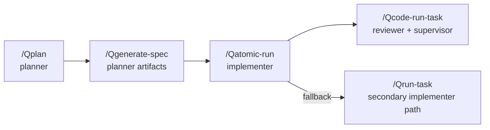

# Multi-Model Setup Guide

> Architectural source of truth: `core/MULTI_MODEL_ORCHESTRATION.md`. This guide shows how to activate the minimum first-pass orchestration layer without changing the runtime engine.

## Overview
- Multi-model orchestration separates planning, implementation, review, and supervision so no single model plans and grades its own work.
- The new workflow relies on config + artifacts under `.qe/ai-team/` to pass context between roles and providers.
- Backward compatibility is preserved: nothing changes until `team-config.json` exists with `mode` set to `multi-model` or `hybrid`.

## Modes
| Mode | When Active | Behavior |
|------|-------------|----------|
| `single-model` | Default, no config or explicit single mode | Legacy Claude-centric path. Planner, implementer, reviewer, supervisor can all be the same provider. No extra artifacts required. |
| `multi-model` | `.qe/ai-team/config/team-config.json` with `mode: "multi-model"` | Strict role handoffs. Planner writes `role-spec.md` + `task-bundle.json`, implementer writes `implementation-report.md`, reviewer writes `review-report.md`, supervisor writes `verification-report.md`. |
| `hybrid` | Config present with `mode: "hybrid"` | Planner + supervisor may stay on Claude while implementation/review run elsewhere. Same artifacts and gates as multi-model. |

## Configuration
1. Run `/Qinit` and opt into **Multi-Model Orchestration**. It creates:
   ```
   .qe/ai-team/
     config/team-config.json
     artifacts/{role-spec.md,task-bundle.json,implementation-report.md,review-report.md,verification-report.md}
     runs/
   ```
2. Validate configs with `node scripts/validate_ai_team_config.mjs .qe/ai-team/config/team-config.json`.
3. Edit the template to match your providers. Fields enforced by `core/schemas/team-config.schema.json`:
   - `version`: must be `1`.
   - `mode`: `single-model`, `multi-model`, or `hybrid`.
   - `roles`: planner, implementer, reviewer, supervisor definitions (provider/model/responsibility required per role).
   - `providers` (optional): execution commands, timeouts, etc.
   - `policies`: `max_remediation_rounds`, `reviewer_can_edit`, `implementer_can_modify_spec`, plus optional `require_review_before_complete`.

### Annotated Example
```jsonc
{
  "version": 1,                              // schema version, locked at 1
  "mode": "multi-model",                     // flips orchestration features on
  "roles": {
    "planner": {
      "provider": "claude",                  // default provider
      "model": "sonnet",
      "responsibility": "Create and refine executable specs"
    },
    "implementer": {
      "provider": "codex",
      "model": "gpt-5-codex",
      "responsibility": "Implement approved task items"
    },
    "reviewer": {
      "provider": "gemini",
      "model": "gemini-2.5-pro",
      "responsibility": "Independently review implementation quality and regressions"
    },
    "supervisor": {
      "provider": "claude",
      "model": "opus",
      "responsibility": "Approve, reject, or request remediation"
    }
  },
  "policies": {
    "max_remediation_rounds": 2,
    "reviewer_can_edit": false,
    "implementer_can_modify_spec": false,
    "require_review_before_complete": true
  }
}
```

## Role Mappings
Primary PSE chain with role ownership:
```
/Qplan (planner) -> /Qgenerate-spec (planner artifacts)
                   -> /Qatomic-run (implementer)
                   -> /Qcode-run-task (reviewer + supervisor gate)
                    \
                     -> /Qrun-task (secondary implementer path for non-atomic work)
```



| Role | Skill Touchpoints | Responsibilities |
|------|-------------------|------------------|
| planner | `/Qplan`, `/Qgenerate-spec` | Interpret requirements, write roadmap, emit `role-spec.md` + `task-bundle.json`. |
| implementer | `/Qatomic-run` (primary), `/Qrun-task` (secondary) | Read approved spec, modify code/tests, log output in `implementation-report.md`. |
| reviewer | `/Qcode-run-task` | Run tests/review loop, produce `review-report.md`, request remediation when findings exist. |
| supervisor | `/Qcode-run-task` | Final gatekeeper, writes `verification-report.md`, enforces remediation policy. |

## Artifact Contract
| Artifact | Path | Owner | Purpose |
|----------|------|-------|---------|
| `team-config.json` | `.qe/ai-team/config/` | project maintainer | Enables multi/hybrid orchestration + provider routing. |
| `role-spec.md` | `.qe/ai-team/artifacts/` | planner only | Objective, scope, constraints, acceptance criteria, execution notes. |
| `task-bundle.json` | `.qe/ai-team/artifacts/` | planner only | Machine-readable tasks with IDs, owners, wave numbers, acceptance criteria. |
| `implementation-report.md` | `.qe/ai-team/artifacts/` | implementer | Changed files, commands/checks run, unresolved risks. |
| `review-report.md` | `.qe/ai-team/artifacts/` | reviewer | Findings + verdict (approve/request_changes). |
| `verification-report.md` | `.qe/ai-team/artifacts/` | supervisor | Final decision (pass/partial/fail/escalate) + evidence/remediation. |

## Getting Started Checklist
1. **Scaffold**: Run `/Qinit`, opt into multi-model scaffolding, and confirm directories plus placeholder artifacts exist.
2. **Configure**: Edit `.qe/ai-team/config/team-config.json` for your providers; re-run `scripts/validate_ai_team_config.mjs`.
3. **Plan**: Run `/Qplan`, ensure planner updates `.qe/planning/*`, and write `role-spec.md` + `task-bundle.json`.
4. **Spec**: Run `/Qgenerate-spec` (Qgs); it mirrors new tasks into the planner artifacts after generating TASK_REQUEST/VERIFY_CHECKLIST files.
5. **Implement**: Use `/Qatomic-run` (or `/Qrun-task` when necessary). Implementer must append to `implementation-report.md` before handing off.
6. **Verify**: `/Qcode-run-task` enforces reviewer (`review-report.md`) and supervisor (`verification-report.md`) gates before marking tasks complete.
7. **Iterate**: Planner reopens scope by editing planner artifacts; implementer/reviewer never overwrite planner-owned files without that signal.

Following these steps activates the minimal orchestration layer described in `core/MULTI_MODEL_ORCHESTRATION.md` while keeping legacy workflows intact for single-model projects.

## Workflow Resume
When a planner pass is already approved, avoid re-planning on every retry.

- Reuse the current approved plan: `node scripts/run_team_workflow.mjs --config .qe/ai-team/config/team-config.json --reuse-approved-plan --execute`
- Resume from implementation only: `node scripts/run_team_workflow.mjs --config .qe/ai-team/config/team-config.json --from-role implementer --execute`
- Resume from review only: `node scripts/run_team_workflow.mjs --config .qe/ai-team/config/team-config.json --from-role reviewer --execute`
- Re-review without prior implementation evidence: `node scripts/run_team_workflow.mjs --config .qe/ai-team/config/team-config.json --from-role reviewer --clear-artifact implementation-report --execute`

`--reuse-approved-plan` automatically starts at `implementer` when both `role-spec.md` and `task-bundle.json` already exist. Use `--from-role` when you want an explicit restart point.
`--clear-artifact` only clears the workflow-local snapshot, not the canonical artifacts.

Each workflow now snapshots the current canonical artifacts into `.qe/ai-team/workflows/<workflow-id>/artifacts/`. Reviewer and supervisor re-runs read those workflow-local snapshots, which prevents later canonical artifact changes from silently changing the evidence set for an in-flight workflow.

If older canonical artifacts already contain boilerplate from prior runs, normalize them once with:

`node scripts/normalize_ai_team_artifacts.mjs`

or

`npm run normalize:ai-team-artifacts`
